# Flex弹性布局

::: warning
设为 Flex 布局以后，子元素的float、clear和vertical-align属性将失效。
:::

## 基本概念
**CSS 弹性盒子布局** 是 CSS 的模块之一，定义了一种针对用户界面设计而优化的 CSS 盒子模型。在弹性布局模型中，弹性容器的子元素可以在任何方向上排布，也可以“弹性伸缩”其尺寸，既可以增加尺寸以填满未使用的空间，也可以收缩尺寸以避免父元素溢出。子元素的水平对齐和垂直对齐都能很方便的进行操控。通过嵌套这些框（水平框在垂直框内，或垂直框在水平框内）可以在两个维度上构建布局。

采用 Flex 布局的元素，称为 Flex 容器（flex container），简称"容器"。它的所有子元素自动成为容器成员，称为 Flex 项目（flex item），简称"项目"。


如上图：容器默认存在两根轴：水平的主轴（main axis）和垂直的交叉轴（cross axis）。主轴的开始位置（与边框的交叉点）叫做`main start`，结束位置叫做 `main end`；交叉轴的开始位置叫做 `cross start`，结束位置叫做`cross end`。

项目默认沿主轴排列。单个项目占据的主轴空间叫做 `main size`，占据的交叉轴空间叫做 `cross size`。

## 弹性盒子(容器)

### 声明定义
使用 `display:flex` 或 `display:inline-flex` 声明为弹性盒子。

**以下6个属性设置在容器上。**

### flex-direction
> `flex-direction` 属性决定主轴的方向 (即项目的排列方向)

| 值             | 描述                           |
|----------------|--------------------------------|
| row            | 从左到右水平排列元素（默认值） |
| row-reverse    | 从右向左排列元素               |
| column         | 从上到下垂直排列元素           |
| column-reverse | 从下到上垂直排列元素           |

```html
<section>
    <div>1</div>
    <div>2</div>
    <div>3</div>
</section>
```
```css {5,6}
section {
    width: 600px;
    border: 1px dashed #ddd;
    margin: 0 auto;
    display: flex;
    /*默认值可省略*/
    flex-direction: row-reverse
}
section div {
    width: 100px;
    height: 100px;
    margin: 10px;
    color: #5a5a5a;
    text-align: center;
    line-height: 100px;
    background: orange;
}
```
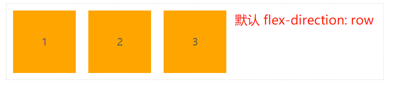
```css {3,2}
section {
    display: flex;
    flex-direction: row-reverse
}
```
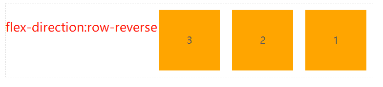

```css
section {
    display: flex;
    flex-direction: column;
    /*flex-direction: column-reverse;  */
}
```
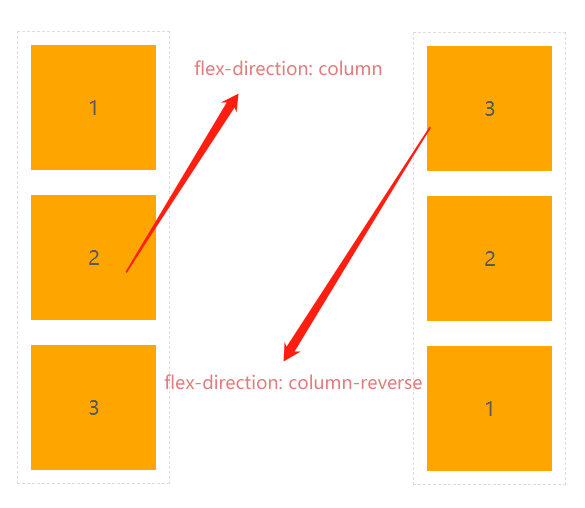

### flex-wrap
默认情况下，项目都排在一条线（又称"轴线"）上。`flex-wrap` 属性定义，如果一条轴线排不下，如何换行。

| 选项         | 说明                                             |
|--------------|--------------------------------------------------|
| nowrap       | 元素不拆行或不拆列（默认值）                     |
| wrap         | 容器元素在必要的时候拆行或拆列。                 |
| wrap-reverse | 容器元素在必要的时候拆行或拆列，但是以相反的顺序 |

```html
<section>
    <div>1</div>
    <div>2</div>
    <div>3</div>
    <div>4</div>
    <div>5</div>
</section>
```
```css
section {
    width: 500px;
    border: 1px dashed #ddd;
    margin: 0 auto;
    display: flex;
}

section div {
    width: 100px;
    height: 100px;
    margin: 10px;
    color: #5a5a5a;
    text-align: center;
    line-height: 100px;
    background: rgb(95, 204, 85);
}
```
- nowrap
```css
section{
    flex-direction: row;
    flex-wrap:nowrap;
}
```
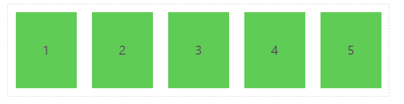

- wrap
```css
section{
    flex-direction: row;
    flex-wrap:wrap;
}
```
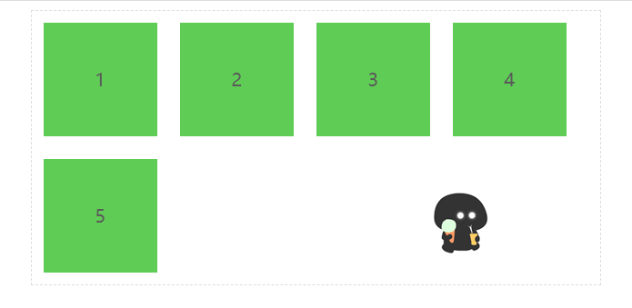


- wrap-reverse
```css
section{
    flex-direction: row;
    flex-wrap:wrap-reverse;
}
```

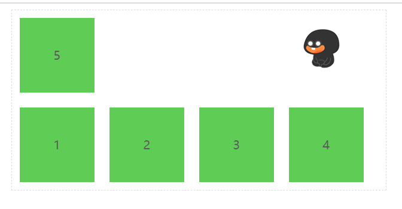

**当主轴为column时 与上类似** 


### flex-flow
> *flex-flow* 是 `flex-direction` 与 `flex-wrap` 的组合简写模式😋。

```css
flex-flow: row-reverse wrap-reverse;
```
从右向左排列，换行向上拆分行。

### justify-content
用于控制元素在 **😛主轴上😛** 的排列方式，主轴主轴主轴 的排列方
式。

| 选项          | 说明                                                                 |
|---------------|----------------------------------------------------------------------|
| flex-start    | 元素紧靠主轴起点                                                     |
| flex-end      | 元素紧靠主轴终点                                                     |
| center        | 元素从弹性容器中心开始                                               |
| space-between | 第一个元素靠起点，最后一个元素靠终点，余下元素平均分配空间           |
| space-around  | 每个元素两侧的间隔相等。所以，项目之间的间隔比项目与边框的间隔大一倍 |
| space-evenly  | 元素间距离平均分配                                                   |


#### flex-start
```html
 <section>
    <div>1</div>
    <div>2</div>
    <div>3</div>
    <div>4</div>
</section>
```

```css {6}
section {
    width: 500px;
    border: 1px dashed #ddd;
    margin: 0 auto;
    display: flex;
    justify-content: flex-start;
}

section div {
    width: 80px;
    height: 80px;
    margin: 10px;
    color: #fff;
    font-size: 20px;
    text-align: center;
    line-height: 80px;
    background: rgb(218, 97, 167);
}
```
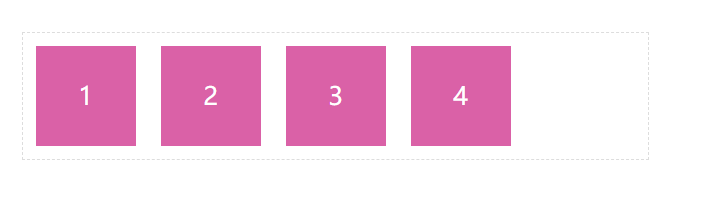

#### flex-end
```css
justify-content: flex-end;
```
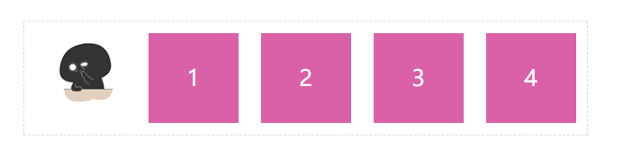

#### center
```css
justify-content: center;
```
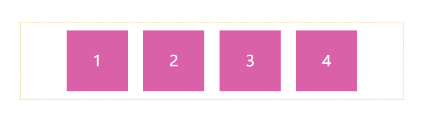

#### space-between
```css{1}
justify-content: space-between;
```
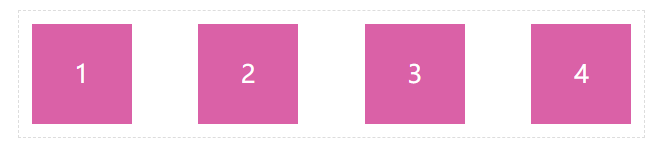


#### space-around
```css {1}
justify-content: space-around;
```
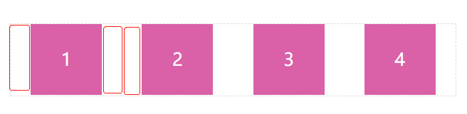

#### space-around
> 平均分配容器元素
```css {1}
justify-content: space-evenly;
```
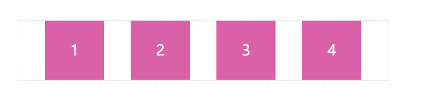

### align-items
用于控制容器元素在😎**`交叉轴** 🤓上的排列方式。 

- flex-start：交叉轴的起点对齐。
- flex-end：交叉轴的终点对齐。
- center：交叉轴的中点对齐。
- baseline: 项目的第一行文字的基线对齐。
- stretch（默认值）：如果项目未设置高度或设为auto，将占满整个容器的高度。


拉伸适应交叉轴
> 如果设置了 `width | height | min-height | min-width | max-width | max-height` ，将影响stretch 的结果，因为 stretch 优先级你低于宽高设置。

```css
.box {
  align-items: flex-start | flex-end | center | baseline | stretch;
}
```
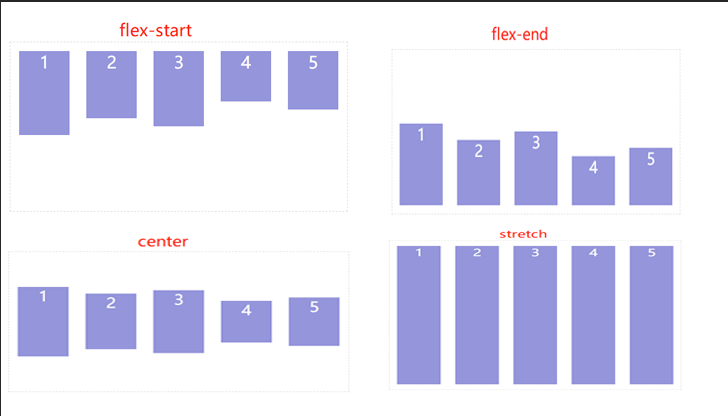


### align-content
> 只适用于多行显示的弹性容器，它的作用是当flex容器在交叉轴上有多余的空间时，对元素的对齐处理。


::: warning
该属性对单行弹性盒子模型无效。（即：带有 flex-wrap: nowrap）。
:::

| 选项          | 说明                                                                 |
|---------------|----------------------------------------------------------------------|
| stretch       | 将空间平均分配给元素                                                 |
| flex-start    | 元素紧靠主轴起点                                                     |
| flex-end      | 元素紧靠主轴终点                                                     |
| center        | 元素从弹性容器中心开始                                               |
| space-between | 第一个元素靠起点，最后一个元素靠终点，余下元素平均分配空间           |
| space-around  | 每个元素两侧的间隔相等。所以，项目之间的间隔比项目与边框的间隔大一倍 |
| space-evenly  | 元素间距离平均分配                                                   |

```html
<section>
    <div>1</div>
    <div>2</div>
    <div>3</div>
    <div>4</div>
</section>
```

```css {7}
section {
    width: 300px;
    height: 300px;
    border: 1px dashed #ddd;
    margin: 0 auto;
    display: flex;
    flex-wrap: wrap;
}

section div {
    width: 80px;
    height: 80px;
    margin: 10px;
    color: #fff;
    font-size: 20px;
    text-align: center;
    line-height: 80px;
    background: rgb(148, 149, 219)
}


```css {1}
align-content: flex-start;
```

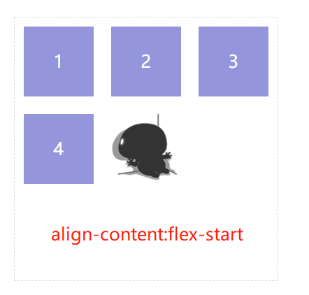

```css {1}
align-content: flex-end;
```
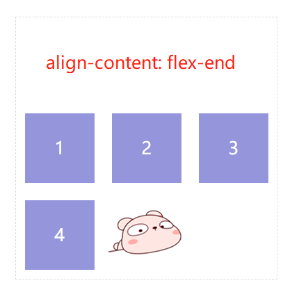

```css 
align-content: space-around;
```
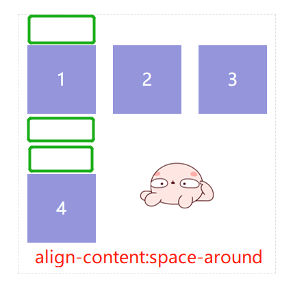

```css 
align-content: space-between;
```
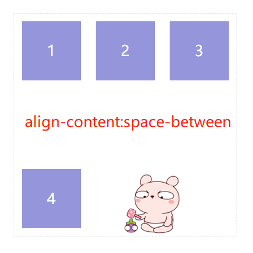

```css 
align-content: space-evenly;
```
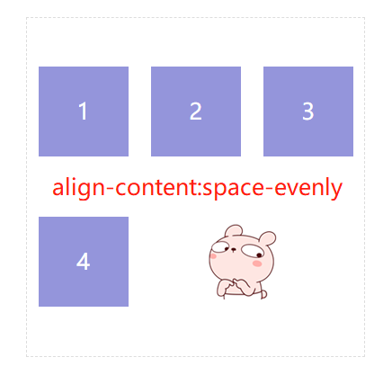


## 弹性元素(项目)

> 放在弹性容器盒子中的元素即为容器元素。

::: warning
- 不能使用float与clear规则
- 弹性元素均为块元素
- 绝对定位的弹性元素不参与弹性布局
:::


