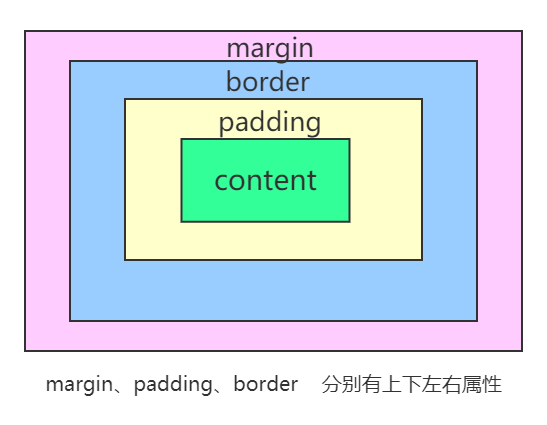

# css盒模型



## 外边距 margin
### 声明定义
边距顺序依次为：上、右、下、左。

```css
         /*上、 右、下、 左*/
   margin:10px 20px 30px 40px;
        /*上下、 左右*/
   margin:20px   30px;
        /* 上   左右    下*/
   margin:20px  30px  10px;
   
   /*外边距全部定义为 10px*/
   margin：10px
```

### 边距合并

相邻元素的``纵向``外边距会进行合并

## 内边距
内边距使用 padding 进行定义，使用语法与 margin 相似。不存在负的内边距


## BOX-SIZING
宽度与高度包括内边距与边框。

[box-sizing](https://developer.mozilla.org/zh-CN/docs/Web/CSS/box-sizing)

box-sizing 属性值
- content-box 
默认值，标准盒子模型

比如说  .box {width: 350px; border: 10px solid black;} 

在浏览器中的渲染的实际宽度将是 370px。

- border-box

``width `` 和 ``height`` 属性包括内容，内边距和边框，但**不包括外边距**。

**width = border + padding + 内容的宽度**

**height = border + padding + 内容的高度**

## 边框 border

### 样式选择

类型 | 描述
---|---
none | 定义无边框。
dotted | 定义点状边框。在大多数浏览器中呈现为实线。
dashed | 定义虚线。在大多数浏览器中呈现为实线。
solid | 定义实线。
double | 定义双线。双线的宽度等于 border-width 的值。
groove | 定义 3D 凹槽边框。其效果取决于 border-color 的值。
ridge | 定义 3D 垄状边框。其效果取决于 border-color 的值。
inset | 定义 3D inset 边框。其效果取决于 border-color 的值。
outset | 定义 3D outset 边框。其效果取决于 border-color 的值。

一次定义四个边

```css
p{
    border-style:double   
    /*双实线*/
}
```
样式顺序为上、右、下、左，可以分别进行定义 **同padding/margin**
```css
h2 {
	border-style: outset solid dotted double;
	border-width: 8px;
}
```

单独设置一边样式
规则 | 说明
---|---
border-top-style | 顶边
border-right-style | 右边
border-bottom-style | 下边
border-left-style | 左边
border-style | 四边

### 边框宽度
规则 | 说明
---|---
border-top-width | 顶边
border-right-width | 右边
border-bottom-width | 下边
border-left-width | 左边
border-width | 四边

### 边框颜色
---|---
规则 | 说明
border-top-color | 顶边
border-right-color | 右边
border-bottom-color | 下边
border-left-color | 左边

## 简写
---|---
规则 | 说明
border-top | 顶边
border-right | 右边
border-bottom | 下边
border-left | 左边
border | 四边
border-color | 四边

```css
p{
    border-bottom:1px solid red;
}
```

### 行内元素边框
行内元素也可以设置边框
```css
span {
	border-bottom: solid 2px red;
}
```

### 圆角边框
使用 border-radius 规则设置圆角，可以使用px | % 等单位。也支持四个边分别设置。

选项 | 说明
---|---
border-top-left-radius | 上左
border-top-right-radius | 上右
border-bottom-left-radius | 下左
border-bottom-right-radius | 下右

也可以像padding / margin 使用简写

```css
div{
    border-radius:5px 10px 
    /* 【左上，右下】5px   
       【右上，左下]10px 
     */
    
    border-radius:5px 8px 10px ;
    /*  【左上】5px 
        【左下，右上】8px
        【右下】 10px
    */
    
    border-radius: 10px  30px  50px  100px;
    /* 方向顺时针  左上  右上  右下  左下*/
}
```

## 轮廓线
元素在``获取焦点时``产生，并且轮廓线不占用空间。可以使用伪类 :focus 定义样式。

- 轮廓线显示在边框外面
- 轮廓线不影响页面布局

### 轮廓线样式
类型 | 描述
---|---
none | 定义无边框。
dotted | 定义点状边框。在大多数浏览器中呈现为实线。
dashed | 定义虚线。在大多数浏览器中呈现为实线。
solid | 定义实线。
double | 定义双线。双线的宽度等于 border-width 的值。
groove | 定义 3D 凹槽边框。其效果取决于 border-color 的值。
ridge | 定义 3D 垄状边框。其效果取决于 border-color 的值。
inset | 定义 3D inset 边框。其效果取决于 border-color 的值。
outset | 定义 3D outset 边框。其效果取决于 border-color 的值。

```css
div{
    outline-style: double;
}
```

### 轮廓线宽设置
```css
div{
    outline-width: 10px;
}
```

### 轮廓线颜色

```css
div{
    outline-color: red;
}
```
### 组合定义

```css
div{
    outline: red solid 2px;
}
```
### 表单轮廓线
表单默认具有轮廓线，但有时并不好看，使用以下样式规则去除。

```css
input:focus {
	outline: none;
}
```

## 元素Display属性
使用 display 控制元素的显示机制。

选项 | 说明
---|---
none | 隐藏元素
block | 显示为块元素
inline | 显示为行元素，不能设置宽/高
inline-block | 行级块元素，允许设置宽/高

使用该属性可以将块级元素与非块级元素相互转换，使其有对应的特性

## VISIBILITY

控制元素的显示隐藏，在隐藏后**空间会保留**。
```html
<style>
	article {
    padding: 30px;
    border: solid 2px red;
    width: 200px;
  }
  article div {
    width: 100px;
    height: 100px;
    border: solid 2px red;
    padding: 20px;
  }
  article div:nth-of-type(1) {
    visibility: hidden;
  }
</style>
<article>
	<div></div>
	<div></div>
</article>
```

## 溢出控制

### 隐藏控制

选项 | 说明
---|---
hidden | 溢出内容隐藏
scroll | 显示滚动条（有些浏览器会一直显示，有些在滚动时显示）
auto | 根据内容自动处理滚动条

溢出隐藏
```css
div {
  width: 400px;
  height: 100px;
  border: solid 2px #ddd;
  padding: 20px;
  overflow: hidden;
}
```

溢出产生滚动条

不同浏览器处理方式不同，有些直接显示出来，有些在滚动时才显示。

```css
div {
  width: 400px;
  height: 100px;
  border: solid 2px #ddd;
  padding: 20px;
  overflow: scroll;
/*overflow-y: scroll;  设置y轴滚动条*/
/*overflow-x: scroll;  设置x轴滚动条*/
}
```

### 文本溢出

**单行文本溢出**
```css
div {
  width: 400px;
  height: 100px;
  border: solid 2px #ddd;
  padding: 20px;
  overflow: hidden;
  text-overflow: ellipsis;
  white-space: nowrap;
}
```

**多行文本溢出控制**
```css
div {
  width: 200px;
  overflow: hidden;
  display: -webkit-box;
  -webkit-line-clamp: 3;
  -webkit-box-orient: vertical;
}
```

## 尺寸定义
可以使用多种方式为元素设置宽、高尺寸。

选项 | 说明
---|---
width | 宽度
height | 高度
min-width | 最小宽度
min-height | 最小高度
max-width | 最大宽度
max-height | 最大高度
fill-available | 撑满可用的空间
fit-content | 根据内容适应尺寸

### min&max

不希望图片太大造成溢出窗口，也不希望太小影响美观，使用以下代码可以做到约束。

```css
<style>
	div {
    width: 400px;
    border: solid 2px #ddd;
    padding: 20px;
  }
  div img {
    min-width: 50%;
    max-width: 90%;
  }
</style>
```

### fill-available
行块元素可以撑满可用空间
```html
<p class="available">The Mozilla community produces a lot of great software.</p>
```
```css
p.available {
    background: lightblue;
    width: -webkit-fill-available;
    text-align: center;
    margin: auto;
}
```
### fit-content
根据内容自动适应宽度
```html
<p class="fit-content">The Mozilla community produces a lot of great software.</p>
```
```css
p.fit-content {
    background: lightblue;
    width: -webkit-fill-available;
    text-align: center;
    margin: auto;
}
```

### min-content
```html
<p class="minblue">The Mozilla community produces a lot of great software.</p>
```
```css
p.minblue {
  background: lightblue;
  width: -moz-min-content;    /* Firefox */
  width: -webkit-min-content; /* Chrome */
}
```

### max-content
```html
<p class="maxgreen">The Mozilla community produces a lot of great software.</p>
```
```css
p.maxgreen {
  background: lightgreen;
  width: intrinsic;           /* Safari/WebKit 使用了非标准的名称 */
  width: -moz-max-content;    /* Firefox/Gecko */
  width: -webkit-max-content; /* Chrome */
}
```

