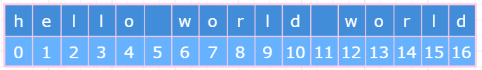

# JavaScript字符串

## 字符串属性

| 属性        | 描述                     |
|-------------|--------------------------|
| constructor | 返回创建字符串属性函数   |
| length      | 返回字符串的长度         |
| prototype   | 允许向对象添加属性和方法 |


## 访问字符方法
**字符串的访问字符方法总共有chartAt()、中括号[]、charCodeAt()和fromCharCode()四种**

### chartAt()
- 😏charAt()方法接收一个基于0的字符位置的参数，返回指定位置的字符。
- 😒当参数为空或 `NaN` 时，默认参数为 `0`；
- 😕当参数超出范围时(大于`length`或小于0)，则返回一个空字符串　

代码示例：
```js
var str = "hello";
console.log(str.charAt(1));   //e
console.log(str.charAt(-1));  //''
console.log(str.charAt(10));  //''
console.log(str.charAt());    <=> str.charAt(0) //h 
console.log(str.charAt(NaN)); <=> str.charAt(0) //h

// 返回字符串最后一个字符
console.log(str.chartAt(str.length-1)); // o
```
::: tip [注意]
- x.charAt(index)
- x.substring(index, index+1)
- x.substr(index,1)
- x.slice(index,index+1)
结果相等
:::

```js
var str = "hello";
console.log(str.charAt(1));      //'e'
console.log(str.substring(1,2)); //'e'
console.log(str.slice(1,2));     //'e'
console.log(str.substr(1,1));    //'e'
```
### []方法
- ECMAScript5定义了另一个访问字符的方法，使用方括号加数字索引来访问字符串中的特定字符。
- 如果参数超出范围或是NaN时，则输出undefined；
- 没有参数时，会报错；该方法没有Number()转型函数的隐式类型转换，但参数为单数值数组时可转换为数值

::: danger
[注意]IE7-浏览器不支持
:::

```js
var str = "hello";
console.log(str[0]);     //h
console.log(str[[1]]);   //e
console.log(str[false]); //undefined
console.log(str[-1]);    //undefined
console.log(str[NaN]);   //undefined
console.log(str[]);      //报错
```

### charCodeAt()
- charCodeAt()方法类似于charAt()方法
- 接收一个基于0的字符位置的参数，但返回的是指定位置的字符16位Unicode编码。
- 返回值是一个16位的整数，在0-65535之间，即0x0000-0xffff之间
- 参数为空或NaN时，默认参数为0；
- 当参数超出范围时，则返回NaN

```js
var str = "hello";
console.log(str.charCodeAt());    //104
console.log(str.charCodeAt(0));   //104
console.log(str.charCodeAt(1));   //101
console.log(str.charCodeAt(-1));  //NaN
console.log(str.charCodeAt(10));  //NaN
console.log(str.charCodeAt(NaN)); //104
```
::: tip
同样地，charCodeAt()方法涉及到Number()函数的隐式类型转换，如果转换为数值，则按照上述规则输出相应值；如果转换为NaN，则输出第0个字符的字符编码
:::

```js
var str = "hello";
console.log(str.charCodeAt(true));   //101
console.log(str.charCodeAt(false));  //104
console.log(str.charCodeAt('abc'));  //104
console.log(str.charCodeAt({}));     //104
console.log(str.charCodeAt([2]));    //l08
```

### fromCharCode()
- String构造函数本身有一个静态方法:fromCharCode()。
- 接收一个或多个字符编码，然后把它们转换成一个字符串。
- 从本质上看，这个方法与实例方法charCodeAt()执行的是相反的操作。
- 若参数为空或NaN时，则返回空字符串；若参数超出0-65535的范围，则输出字符不可控

```js
console.log(String.fromCharCode(104,101,108,108,111));  //'hello'
console.log(String.fromCharCode());       //''
console.log(String.fromCharCode(NaN));    //''
console.log(String.fromCharCode(-1));     // 
console.log(String.fromCharCode(65560));  // 
```
**如果一个字符占用四字节，则需要拆成两个字符表示**
```js
console.log(String.fromCharCode(0xD842, 0xDFB7)); // "𠮷"
```

## 字符串拼接
**字符串拼接共有 `concat()` 和加号 `+` 两种方法**
### concat()
- 用于将一个或多个字符串拼接起来，返回拼接得到的新字符串，而**原字符串不发生改变。**
- 若参数(第一个参数除外)不是字符串，则通过String()方法隐式转换为字符串，再进行字符串拼接
> 语法 str.concat(str2 [，... strN ])

```js
var str1 = "Hello ";
var str2 = "world!";
var n = str1.concat(str2);
console.log(n); // Hello world
```
::: danger
[注意]第一个参数只能是字符串，如果是其他类型(数组除外)则报错
:::
```js
(10).concat('2');         //报错
(true).concat('false');   //报错
({}).concat('abc');       //报错
```

**拼接多个字符**
```js
var str = "hello ".concat('world ',...["I ","Love ","you"]);
str;
"hello world I Love you"
```

::: tip
[注意]由于数组也存在concat()方法，参数会**按照首先出现的参数**是数组还是字符串来决定如何转换
:::

```js
'1,2,3,'.concat([4,5]);//'1,2,3,4,5'
[1,2,3].concat(',4,5');//[1, 2, 3, ",4,5"]
```

### 加号运算符(+)

虽然concat()是专门用来拼接字符串的方法，但实践中使用更多的还是加号运算符(+)。使用加号运算符在许多时候都比concat()简单方便

```js
var str = 'hello ';
console.log(str.concat('world','!')); // 'hello world!'
console.log(str + 'world' + '!');     // 'hello world!' 
```

## 创建子字符串
**创建子字符串共有slice()、substr()和substring()三种方法**

### slice()
- slice(start,end)方法需要两个参数starsubstring()t和end
- **返回这个字符串中从start位置的字符到⚠️(但不包含)end位置⚠️的字符的一个子字符串；**
- 如果end为undefined或不存在，则返回从start位置到字符串结尾的所有字符
- 如果start是负数，则start = max(length + start,0)
- 如果end是负数，  则  end = max(length + end,0)
- start和end无法交换位置

```js
var str = 'hello world';            //length=11
console.log(str.slice());           //'hello world'
console.log(str.slice(0, 2));       //'he'
console.log(str.slice(0, -2));      //'hello wor'
console.log(str.slice(2));          //'llo world'
console.log(str.slice(-2));         //'ld'
console.log(str.slice(2,undefined));//'llo world'
console.log(str.slice(2,-5));       //'llo '
console.log(str.slice(2,-20));      //''
console.log(str.slice(20));         //''
console.log(str.slice(-2,2));       //''
console.log(str.slice(-2,-20));     //''            
console.log(str.slice(-2,20));      //'ld'
console.log(str.slice(-20,2));      //'he'
console.log(str.slice(-20,-2));     //'hello wor'
```
::: tip
- slice()方法涉及到Number()转型函数的隐式类型转换，
- 当start被转换为NaN时，相当于start = 0；
- 当end被转换为NaN时(end为undefined除外)，则输出空字符串
:::

```js
var str = 'hello world';
console.log(str.slice(NaN));           //'hello world'
console.log(str.slice(0,NaN));         //''
console.log(str.slice(true,[3]));      //'el'
console.log(str.slice(null,undefined));//'hello world'
console.log(str.slice({}));            //'hello world'
console.log(str.slice('2',[5]));       //'llo'
```

### substring()
- substring(start,end)方法需要两个参数start和end，
- **返回这个字符串中从start位置的字符到(但不包含)end位置的字符的一个子字符串**
- 如果end为undefined或不存在，则返回从start位置到字符串结尾的所有字符
- 如果任一参数是NaN或负数，则被0取代
- 如果任一参数大于字符串长度，则被字符串长度取代
- 如果start 大于 end，则交换它们的值
```js
var str = 'hello world';
console.log(str.substring());           //'hello world'
console.log(str.substring(2));          //'llo world'
console.log(str.substring(2,undefined));//'llo world'
console.log(str.substring(20));         //''
console.log(str.substring(-2,2));       //'he'
console.log(str.substring(NaN,2));      //'he'
console.log(str.substring(-2,20));      //'hello world'
console.log(str.substring(3,2));        //'l'
console.log(str.substring(3,NaN));      //'hel'
console.log(str.substring(-20,2));      //'he'
console.log(str.substring(-20,-2));     //'' 
```

::: tip
同样地，substring()方法也涉及到Number()转型函数的隐式类型转换
:::

```js
var str = 'hello world';
console.log(str.substring(true,[3]));      //'el'
console.log(str.substring(null,undefined));//'hello world'
console.log(str.substring({}));            //'hello world'
console.log(str.substring('2',[5]));       //'llo'
```

### substr()
> 返回指定位置的子字符串
- substr 方法也是接受两个参数
- 第一个是返回字符串的开始位置，与substring/slice不同的是，
- 第二个参数是返回字符的个数，而不是结束位置。

```js
var x="this is a string" console.log(x.substr(3,3));   //s i 空格也算是一个字符
```

## 大小写转换
**ECMAScript中涉及字符串大小写转换的方法有4个：toLowerCase()、toLocaleLowerCase()、toUpperCase()、toLocaleUpperCase()**

### toLowerCase()
> 把字符串转换为小写

```js
var str1 = "Hello";
console.log(str1.toLowerCase()) //hello
```
### toUpperCase()
> 把字符串转换为小写
```js
var str1 = "hello";
console.log(str1.toUpperCase()) //HELLO
```

### toLocaleUpperCase()
> 将字符串转换成大写(针对地区)

### toLocaleLowerCase()
> 将字符串转换成小写(针对地区)
::: danger
这4种方法均不支持String()隐式类型转换，只支持字符串类型
:::

```js
(true).toLowerCase();    //报错
(2).toLocaleLowerCase(); //报错
({}).toUpperCase();      //报错
([]).toLocaleUpperCase();//报错
```

::: tip 
[注意]大小写转换方法可以连续使用
:::
```js
var str = 'Hello World';
console.log((str.toUpperCase()).toLowerCase()); //hello world
```

**将带有分割符的字符串转换为驼峰的形式**
```js
var txt = "border-top-left";
var arr = txt.split('-');
for(var i = 1; i < arr.length; i++){
    arr[i] = arr[i].charAt(0).toUpperCase() + arr[i].slice(1);
}
var result = arr.join('');
console.log(result);     //'borderTopLeft"
// --------------------------
var str = 'border-top-right';
var arr = str.split("-");
var result = arr.map((item,index)=>{
return index>1 ? item.charAt(0).toUpperCase()+item.slice(1):item;
}).join("");
result;
```

## 查找子字符串位置
::: tip
有两个从字符串中查找子字符串位置的方法: **indexOf()** 和 **lastIndexOf()**。**通过字符串查找位置**
查找子串位置的方法同访问字符方法charAt()和中括号[]方法 **通过位置查找字符**
:::

### indexOf()
- indexOf(searchString,start)方法接收searchString和start两个参数 
- 返回searchString **首次出现的位置**，如果没有找到则返回`-1`
- searchString表示要搜索的子字符串；
- start表示该搜索的开始位置，若忽略该参数或该参数为undefined、NaN或负数时，start = 0

::: warning 注意
- 一个空格也会占位一个字符
- 该方法会隐式调用String()转型函数，将searchString非字符串值转换为字符串；
- 隐式调用Number()转型函数，将start非数字值(undefined除外)转换为数值
:::

```js
var str = 'hello world world';
console.log(str.indexOf('ld'));            // 9
console.log(str.indexOf('ld',undefined));  // 9
console.log(str.indexOf('ld',NaN));        // 9
console.log(str.indexOf('ld',-1));         // 9
// 释上：start表示该搜索的开始位置，若忽略该参数或该参数为undefined、NaN或负数时，start = 0

console.log(str.indexOf('ld',10));         // 15
console.log(str.indexOf('ld',[10]));       // 15
// 释上 隐式调用Number()转型函数，将start非数字值(undefined除外)转换为数值

console.log(str.indexOf('true',[10]));     // -1
console.log(str.indexOf(false,[10])) <=> str.indexOf('false',10);  // -1
//释上 隐式调用String()、Number转型函数 
```

### lastIndexOf()
- 与indexOf()不同，lastIndexOf()从右向左查找
- lastIndexOf(searchString,start)方法接收searchString和start两个参数
- **返回searchString第一次出现的位置，如果没有找到则返回-1**
- 隐式调用String()转型函数，将searchString非字符串值转换为字符串；
- 隐式调用Number()转型函数，将start非数字值(undefined除外)转换为数值
- searchString表示要搜索的子字符串；
- start表示该搜索的开始位置，若忽略该参数或该参数为undefined、NaN时，start = length - 1；若start为负数，start = 0


```js
var string = 'hello world world';
// 若忽略该参数或该参数为undefined、NaN时，start = length - 1
console.log(string.lastIndexOf('ld'));            //15
console.log(string.lastIndexOf('ld',undefined));  //15
console.log(string.lastIndexOf('ld',NaN));        //15
// 若start为负数，start = 0
console.log(string.lastIndexOf('ld',-1));         //-1
console.log(string.lastIndexOf('h',-1));          //0
console.log(string.lastIndexOf('w',undefined));   //12
// 隐式转换
console.log(string.lastIndexOf('ld',10));         //9
console.log(string.lastIndexOf('ld',[10]));       //9
console.log(string.lastIndexOf('true',[10]));     //-1
console.log(string.lastIndexOf(false,[10]));      //-1
```
**查找出字符串所有符合条件的子字符串**
可以通过循环调用indexOf()或lastIndexOf()来找到所有匹配的子字符串

```js
// @params str:目标字符串 value:要查找的自字符串
// @return Array [自字符串在目标字符串中出现的索引]
function allIndexOf(str,value){
    var result = [];
    var pos = str.indexOf(value);
    while(pos > -1){
        result.push(pos);
        pos = str.indexOf(value,pos+value.length);
    }
    return result;
}
console.log(allIndexOf('helllhelllhelll','ll'));//[2,7,12]
```

**lastIndexOf()方法常用于获取URL地址中的扩展名**
```js
var url = "http://baid.com/test.txt";
function getFileFormat(url){
    var pos = url.lastIndexOf('.');
    return url.slice(pos+1);
}
console.log(getFileFormat(url)); // 'txt'
```

## 正则匹配方法
String类共有match()、search()、replace()、split()这4种正则匹配方法 

### match()
> 语法 str.match(regexp)

示例 在字符串中查找 "ain"
```js
var str="The rain in SPAIN stays mainly in the plain";
var n=str.match(/ain/g);
console.log(n); // ["ain", "ain", "ain"]
``` 
全局查找字符串 "ain"，且不区分大小写

```js
var str="The rain in SPAIN stays mainly in the plain";
var n=str.match(/ain/gi);
console.log(n); //["ain", "AIN", "ain", "ain"]
```
### search()
- search()方法接受一个正则或字符串的参数，
- **返回匹配的内容在字符串中首次出现的位置**，类似于不能设置起始位置的indexOf，找不到返回-1
::: warning
[注意]search()方法不执行全局匹配，忽略全局标志g，也会忽略RegExp对象的lastIndex属性，总是从字符串的开始位置开始搜索
:::


### replace()

- replace()方法用于替换一个或多个子字符串。它接收两个参数
- 第一个是正则表达式或字符串，表示待查找的内容；
- 第二个是字符串或函数，表示替换内容。返回替换后的字符串

#### 字符串替换，只能替换第一个子字符串
```js
var str = 'cat,bat,sat,fat';
var result = str.replace('at','ond');
console.log(result);//'cond,bat,sat,fat'
```
#### 不设置全局标志g，也只能替换第一个子字符串
```js
var str = 'cat,bat,sat,fat';
var result = str.replace(/at/,'ond');
console.log(result);//'cond,bat,sat,fat'
```
#### 设置全局标志g，替换所有匹配的子字符串
```js
var str = 'cat,bat,sat,fat';
var result = str.replace(/at/g,'ond');
console.log(result);//'cond,bond,sond,fond'
```
#### 首字母大写
```js
var text = 'one two three';
var result = text.replace(/\b(\w+)\b/g,function(match,m1,pos,originalText){
    return m1.charAt(0).toUpperCase()+m1.substring(1); 
})
console.log(result);
```

### split() 常用
- split()方法基于指定的分隔符将一个字符串分割成多个字符串
- 将结果放在一个数组中，分隔符可以是字符串，也可以是一个RegExp
- 该方法可以接受第二个参数(可选)用于指定数组的大小，如果第二个参数为0-array.length范围内的值时按照指定参数输出，其他情况将所有结果都输出
- 若指定分隔符没有出现在字符串中，则以数组的形式返回原字符串的值
```js
var colorText = 'red,blue,green,yellow';
console.log(colorText.split(''));
//["r", "e", "d", ",", "b", "l", "u", "e", ",", "g", "r", "e", "e", "n", ",", "y", "e", "l", "l", "o", "w"]
console.log(colorText.split(','));      //["red", "blue", "green", "yellow"]
console.log(colorText.split(',',2));    //["red", "blue"]
console.log(colorText.split(',',6));    //["red", "blue", "green", "yellow"]
console.log(colorText.split('-'));      //["red,blue,green,yellow"]
console.log(colorText.split(/\,/));     //["red", "blue", "green", "yellow"]
console.log(colorText.split(/e/));      //["r", "d,blu", ",gr", "", "n,y", "llow"]
console.log(colorText.split(/[^\,]+/)); //将除去逗号以外的字符串变为分隔符["", ",", ",", ",", ""],IE8-会识别为[",",",",","]
```

## 去除首尾空格
- ECMAScript5为所有字符串定义了trim()方法。
- 会创建一个字符串的副本，删除前置及后缀的所有空白字符，然后返回结果
- 由于trim()方法**返回的是字符串的副本**，所以原始字符串中的前置及后缀空格会保持不变
- [注意]IE8-浏览器不支持

### trim()
> 去除字符串两头空白

```js {2}
var str = '    hello world   ';
console.log(str.trim()); // 'hello world'
console.log(str);        // '    hello world   '
```

**空白字符不仅仅包括空格，还包括制表符(`\t`)、换行符(`\n`)和回车符(`\r`)**
```js
'\r\nabc \t'.trim()    // 'abc'
```

**用trim()来判断输入的字符是否为空**
```js
if(usename.trim().length){
     alert('correct');
}else{
      alert('error');
}
```

**用正则表达式模拟trim()**
```js
function fnTrim(str){
    return str.replace(/^\s+|\s+$/,'')
}  
console.log(fnTrim('      hello world   '));//'hello world'
```
### trimRight()
**firefox、safari和webkit还支持非标准的trimRight()用于删除字符串结尾的空白字符**
```js
var str = '    hello world   ';
console.log(str.trimRight());//'    hello world';
```

## Es6新增
### includes()
- 返回布尔值，表示是否找到了参数字符串。
- 第二个参数，表示开始搜索的位置。

示例：查找字符串是否包含 "world"

```js
 var str = "Hello world,welcome！";
 var n = str.includes("world");
 var fuck = str.includes("fuck");
 console.log(n); // true
 console.log(fuck) //false
```
在指定的位置后查找是否存在字符串
```js
var str = "Hello world, welcome to the jc-sir.github.io.";
var n = str.includes("world", 12); // false
```
### startsWith()
- 表示参数字符串是否在原字符串的头部。
- **返回Boolen**
- 第二参数指定开始位置

```js
let s = 'Hello world!';
s.startsWith('Hello')    // true
s.startsWith('world', 6) // true
```

### endsWith()
- 表示参数字符串是否在原字符串的尾部。
- **返回Boolen**
- 第二参数指定开始位置

```js
let s = 'Hello world!';
s.endsWith('!')         // true
s.endsWith('Hello', 5)  // true
```

### repeat()
- repeat方法返回一个新字符串，表示将原字符串重复n次。
- 参数如果是小数，会被取整。
- 如果repeat的参数是负数或者Infinity，会报错。
- 如果repeat的参数是字符串，则会先转换成数字。
- 参数是 0 到-1 之间的小数，则等同于 0，这是因为会先进行取整运算。0 到-1 之间的小数，取整以后等于-0，repeat视同为 0。
- 参数NaN等同于 0。

```js
'x'.repeat(3)          // "xxx"
'hello'.repeat(2)      // "hellohello"
'na'.repeat(0)         // ""

'na'.repeat(2.9)       // "nana"
'na'.repeat(Infinity)  // RangeError
'na'.repeat(-1)        // RangeError
'na'.repeat(-0.9)      // ""
'na'.repeat(NaN)       // ""
'na'.repeat('na')      // ""
'na'.repeat('3')       // "nanana"
```

### padStart()
字符串补全长度的功能。如果某个字符串不够指定长度，会在头部或尾部补全。padStart()用于头部补全，padEnd()用于尾部补全。
### padEnd()
