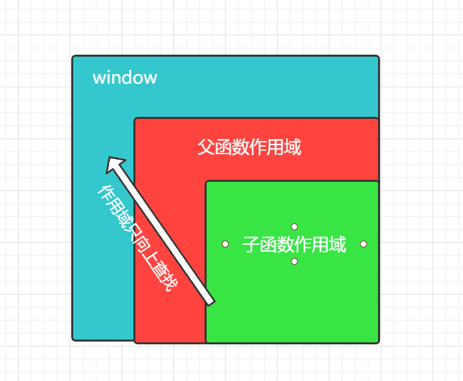

# 作用域与闭包

## 作用域 :tada:

全局作用域只有一个，每个函数又都有作用域（环境）。

- 编译器运行时会将变量定义在所在作用域
- 使用变量时会从当前作用域开始向上查找变量
- 作用域就像攀亲戚一样，晚辈总是可以向上辈要些东西

## 使用规范

作用域链只向上查找，找到全局window即终止，应该尽量不要在全局作用域中添加变量。

嵌套函数可访问声明于它们外部作用域的变量




- 函数被执行后其环境变量将从内存中删除。

- 函数每次调用都会创建一个新作用域

- 如果子函数被使用时父级环境将被保留

 ```js
 function test() {
  let n = 1;
  return function() {
    let b = 1;
    return function() {
      console.log(++n);
      console.log(++b);
    };
  };
}
let a = test()();
a(); //2,2
a(); //3,3
 ```
 
 - 构造函数，子函数被外部使用父级环境将被保留
 
```js
function User() {
  let a = 1;
  this.show = function() {
    console.log(a++);
  };
}
let a = new User();
a.show(); //1
a.show(); //2
let b = new User();
b.show(); //1
```

## 闭包 

闭包就是能够**读取其他函数内部变量**的函数。

由于在Javascript语言中，只有函数内部的子函数才能读取局部变量，因此可以把闭包简单理解成"定义在一个函数内部的函数"。

闭包就是将函数内部和函数外部连接起来的一座桥梁。

