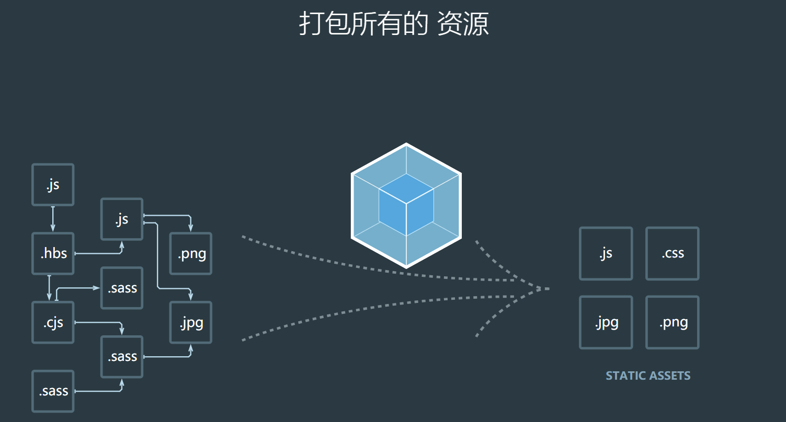

# webpack 入门到放弃
## Webpack是个啥？
:::tip 简单了解下 🐌
- Webpack 是一种**前端资源构建工具**，一个静态模块打包器(module bundler)。
- Webpack 会把前端所有资源文件(js/json/css/img/less/...)作为模块处理。
- 根据模块的依赖关系进行静态分析，打包生成对应的静态资源(bundle)
:::

> 去官网偷张图 😀

## Webpack核心概念
### 1、Entry
入口（Entry）指示Webpack以哪个文件为入口起点开始打包，分析构建内部依赖图。
### 2、Output
输出（Output)指示Webpack打包后的资源bundles输出到哪里，以及如何命名。
### 3、Loader
Loader 让Webpack能处理非JavaScript文件（因为webpack自身只能理解JavaScript）
### 4、Plugins
插件（plugins）可以执行范围更广的任务。范围包括**打包优化**和**压缩**、重新定义环境中的变量等。
### 5、Mode
模式（Mode）指示Webpack使用相应的模式配置

| 选项        | 描述                                                                                                                                                                                                                                       | 特点                       |
|-------------|--------------------------------------------------------------------------------------------------------------------------------------------------------------------------------------------------------------------------------------------|----------------------------|
| development | 会将 `process.env.NODE_ENV` 的值设为 `development`。启用 `NamedChunksPlugin` 和 `NamedModulesPlugin`。                                                                                                                                     | 能让代码本地调试运行的环境 |
| production  | 会将 `process.env.NODE_ENV` 的值设为 `production`。启用 `FlagDependencyUsagePlugin`, `FlagIncludedChunksPlugin`, `ModuleConcatenationPlugin`,`NoEmitOnErrorsPlugin`, `OccurrenceOrderPlugin`, `SideEffectsFlagPlugin` 和 `UglifyJsPlugin`. | 能让代码优化上线运行的环境 |

